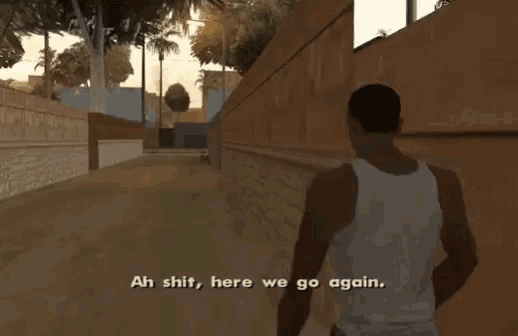
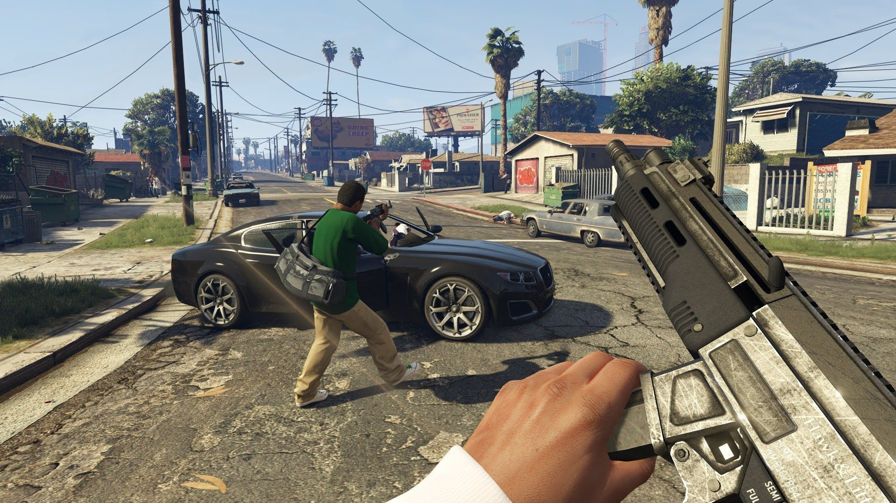
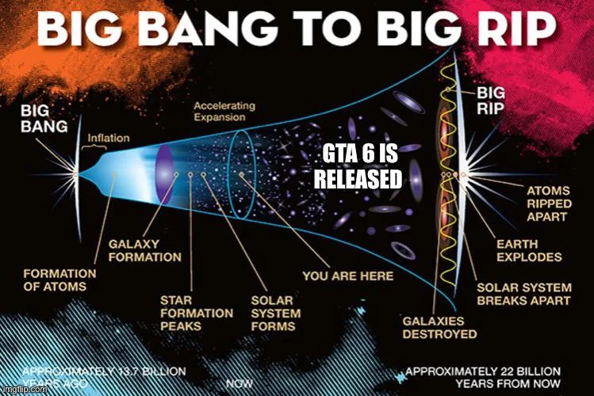

+++
author = "Vighnesh Nilajakar"
title = "Grand Theft Auto 6: An Exciting Future for the Beloved Franchise"
date = "2023-05-28"
description = "Waiting for GTA 6: A Game of Patience, Hope, and Aging Gracefully. Will Rockstar Grant Us One Last Heist ?"
tags = [
    "GTA 6",
	"GTA"]
categories = [
    "gaming"]
series = ["GTA 6"]
aliases = ["GTA 6"]
image = "GTA6_poster.webp"
+++

# Grand Theft Auto 6: An Exciting Future for the Beloved Franchise.

## Introduction:
Grand Theft Auto 6 (GTA 6) has been a highly anticipated game for fans of the franchise. In this blog post, we will delve into the recent announcements and leaks surrounding GTA 6, discussing its potential setting, gameplay features, and the expectations we can have for this highly anticipated title.

## Confirmation of GTA 6 Development:
Rockstar Games, the developer behind the Grand Theft Auto series, recently confirmed that active development for GTA 6 is underway. This news shouldn't come as a surprise since GTA is Rockstar's flagship franchise. While they have worked on other projects in recent years, it's clear that GTA 6 holds a special place in their lineup.



## The Importance of a Single-Player Campaign:
There have been concerns among fans that GTA 6 might focus solely on multiplayer and neglect the single-player experience. However, it's highly unlikely that Rockstar would make such a decision. Given the massive success of the previous GTA titles and the demand for a strong narrative-driven campaign, it's safe to assume that GTA 6 will feature a banging single-player campaign.

## Speculation on Setting:
The setting of GTA 6 has been a topic of much speculation and excitement among fans. While some rumours suggested a return to Vice City, others proposed different locations. Based on the leaks and hints so far, it's highly likely that GTA 6 will indeed take place in Vice City, the iconic fictional city inspired by Miami. The game's focus on the drug trade in a sprawling metropolis fits perfectly with the Vice City setting.

## GTA 5 Expanded and Enhanced:
Before diving into GTA 6, it's worth mentioning the upcoming release of GTA 5 Expanded and Enhanced. This new version of the game is set to feature significant graphical upgrades, including 4K resolution, 60 frames per second, improved textures, draw distances, and the inclusion of ray tracing technology. It's an exciting update that will bring enhanced visuals and improved performance to the current generation of consoles.

## The Technological Leap in GTA 6:
GTA 6 is expected to be a generational leap over its predecessor, taking advantage of the improved hardware capabilities of the new consoles and advanced technologies. Rockstar has been working on implementing features like ray tracing, immersive 3D audio, platform-specific enhancements, and faster loading times. These upgrades, along with Rockstar's proprietary Rage Engine, will allow for a visually stunning and immersive gameplay experience.

## Project Americas and Drug Trade Theme:
The leaked map known as "Project Americas" provides a glimpse into the speculated map for GTA 6. It showcases mainland Florida, including Miami (Vice City), and hints at a massive body of water that would enable players to travel between the United States and South American countries. This suggests a strong focus on the drug trade, which has been a significant theme in the GTA series. It's an exciting prospect that opens up various gameplay possibilities.

## Development Challenges and Release Date:
Developing a game as ambitious as GTA 6 takes time, especially considering the massive scale and complexity of modern open-world games. Rockstar's commitment to delivering high-quality games means that GTA 6's development has likely been a lengthy process. While an exact release date is uncertain, it's safe to assume that the game won't be released for at least another year or two from the time of the first teaser trailer.

## Conclusion:
Rockstar Games has a track record of delivering exceptional gaming experiences, and the upcoming
The title has the potential to surpass all expectations. With the rumoured return to Vice City, an immersive single-player campaign, and technological advancements, GTA 6 promises to be an exciting leap forward for the beloved franchise. While we eagerly await more news and an official release date, let's cherish the memories of previous GTA games and anticipate the adventures that await us in the near future.s