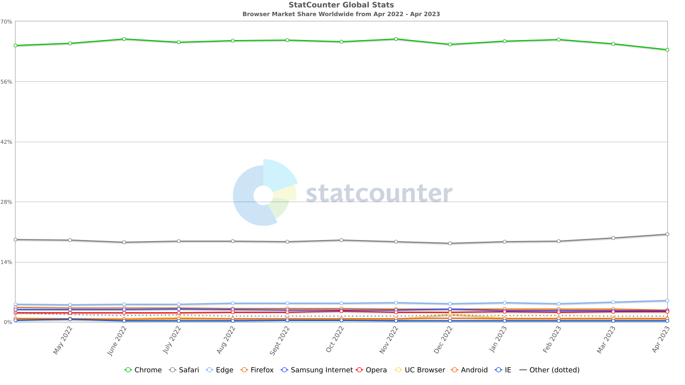
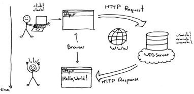
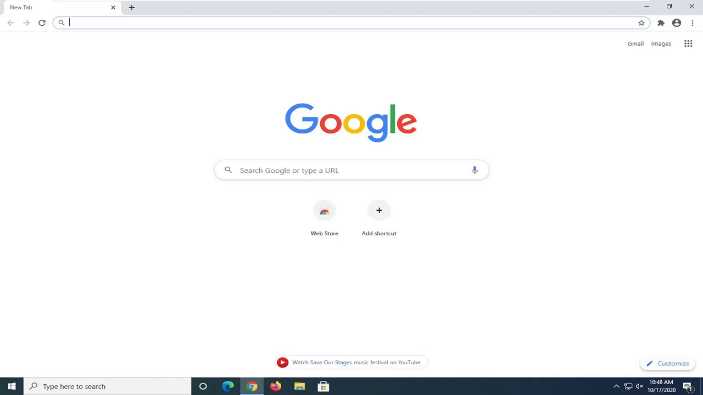
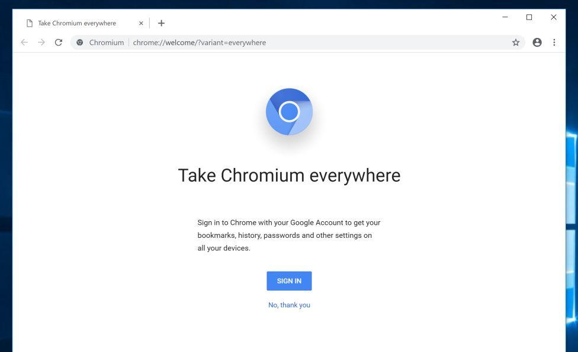
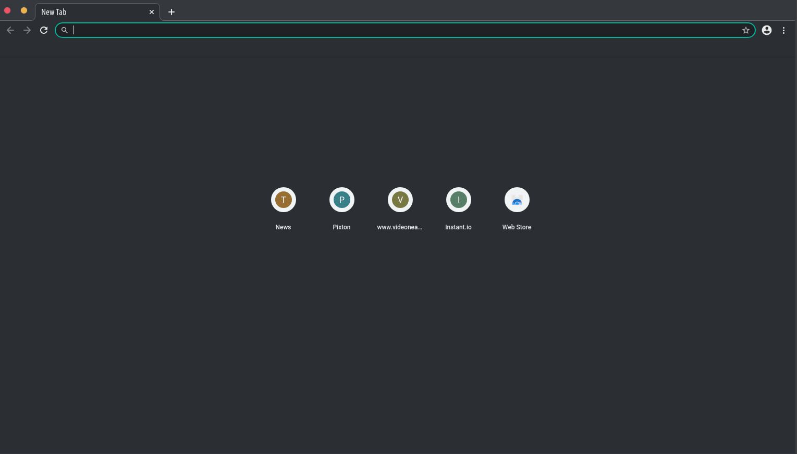
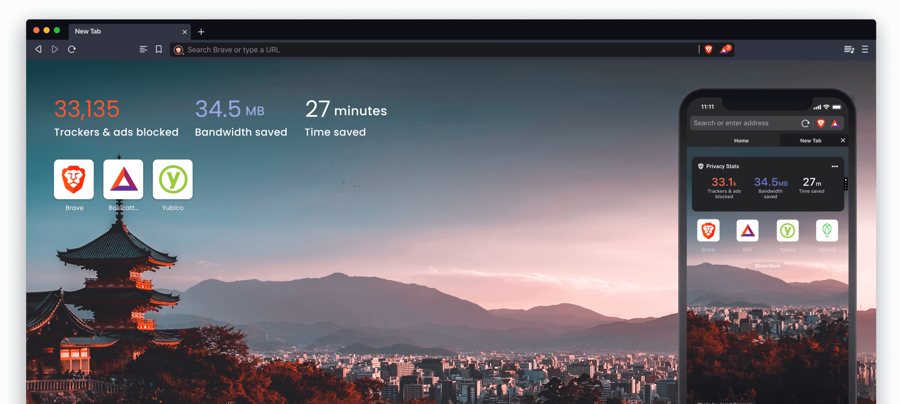
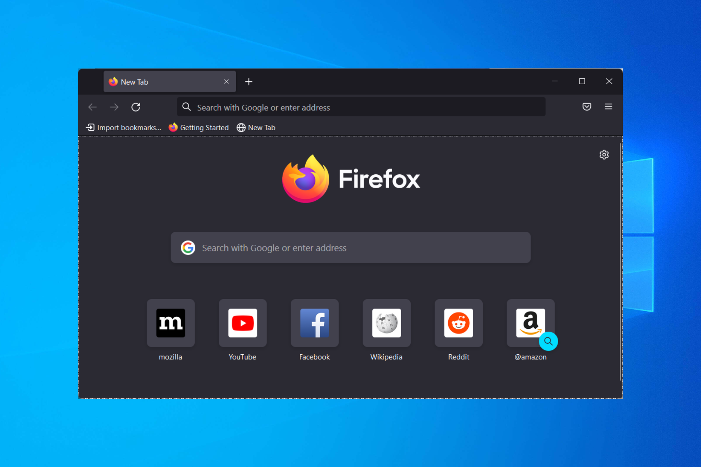
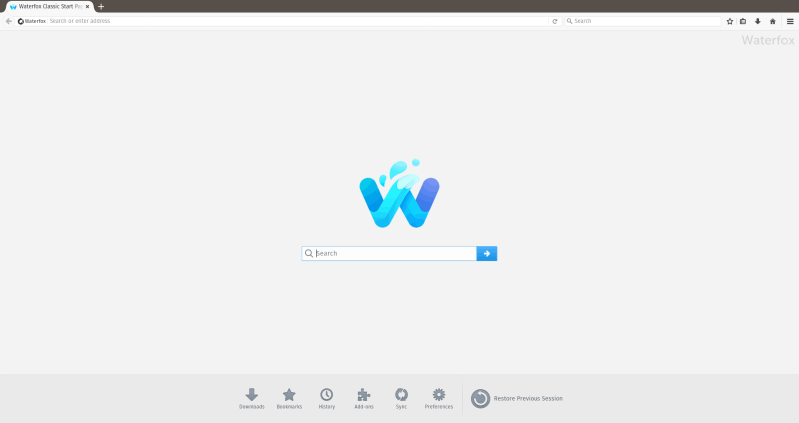
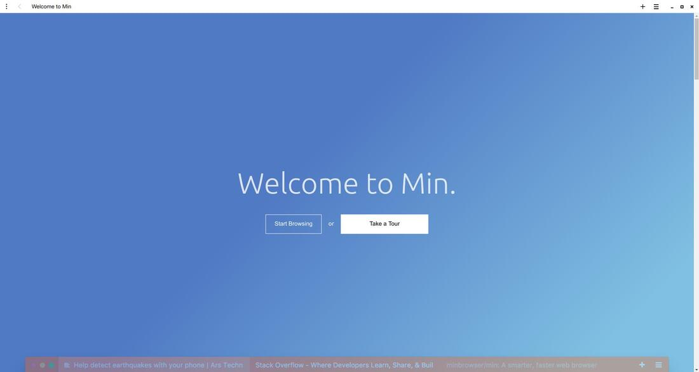

+++
author = "Vighnesh Nilajakar"
title = "Browsers"
date = "2023-05-29"
description = "Browsers, The Holy Portal to the Internet."
tags = [
    "Browsers",
    "GUI"]
categories = [
    "Applications"]
image = "browsers_poster.webp"
+++

## Introduction

Browsers, The Holy Portal to the Internet. Nowadays, People mostly use Laptops or PCs to access the Internet via Web Browsers. Most Machines are used to Browse or Edit Documents. Now, Browsers do Support a lot of Functionalities. So, they need to be Features Rich. As a result, they become Chunky. In this Blog, I won't be talking about [CLI(Command Line Interface) based Browsers](https://itsfoss.com/terminal-web-browsers/). As, They are really complex to use, even for me. So, I prefer using [GUI(Graphical User Interface)](https://en.wikipedia.org/wiki/Graphical_user_interface) based Browsers. Most browsers today are based on Chromium, and only a few Gekko and Webkit-based Browsers exist.

## How Web Browsers work ?

A Browser is used to locate, retrieve and display content on the World Wide Web, including Web pages, images, video, and other files. The browser runs on the Client's Computer, Contacts the Web server, and requests information. The Web server sends the response back to the Web browser, Which displays the results on the computer or other Internet-enabled device that supports a browser. Now, The Browser and Server communicate with each other basically in HTML to reduce the strain of Downloading larger files. It's the Web Browser's Job to compile the Code and present it to the Client in the form of a Webpage. So, A browser needs to be Feature Rich and must support most Elements and Languages.

## Selection Basis

What Browsers should you use then? In this list, I will be focusing on Free & Open Source, Privacy respecting browsers. Also, I will add a Minimalistic Browser for those Slow PCs. As most browsers are Chromium based you can easily [Import Settings](https://support.google.com/chrome/answer/96816?hl=en) once you set up any one Chromium based browser. But I suggest reviewing all Settings as different browsers provide different Functionalities and Features. You can just [Google](https://www.google.com/) what a Function does and Configure your browser according to your needs. Also, I will add Installation Commands of [winget](https://vighneshnilajakar.github.io/blogs/package_management/#winget) or [choco](https://vighneshnilajakar.github.io/blogs/package_management/#chocolatey) at the end of every Browser's Description.

* ### Google Chrome

Now, I know you all absolutely love using [Google Chrome](https://www.google.com/intl/en_in/chrome/). I Admit that Chrome is Optimized for most Hardware, and It has Improved itself over time. Also, [Google Services](https://about.google/products/#all-products) works best in Chrome, and you get A variety of Services from Google. But it still Hogs up a lot of System Resources and is stuffed with telemetry. So, I won't even consider using that Proprietary piece of Shit.

* ### Chromium

[Chromium](https://www.chromium.org/Home/) is an Open Source Browser that is the Base for most browsers. Yup, Google Chrome, and most other browsers are based on Chromium. It's Open Source, and Unlike Google Chrome it doesn't include Telemetry Stuff. Still, It works just like Google Chrome and Integrates well with Google Services and Websites.  
Installation Command : `winget install -e --id Hibbiki.Chromium`

* ### Ungoogled Chromium

[Ungoogled Chromium](https://ungoogled-software.github.io/) is just like Chromium, but without Google Services baked in. You can use Google Services and other Functionalities, But it just doesn't bake in those services by default. As a result, It doesn't Bloat itself and decreases Resource Usage. It features tweaks to enhance privacy, transparency, and control. all in all, if you don't want to share your data with Google you can use Ungoogled-Chromium.  
Installation Command : `winget install -e --id eloston.ungoogled-chromium`

* ### Brave Browser

[Brave](https://brave.com/en-in/), This Browser is the best Browser for Normies. If you don't want to configure a browser to block Ads and respect your privacy, Brave is the best Option. If you configure it a bit, It works like a Charm. If you just disable the Crypto Stuff, it works really great. I would really suggest you Configure the Browser once. It Blocks Advertisements from every single Website. It prevents Trackers and Fingerprinting too.  
Installation Command : `winget install -e --id BraveSoftware.BraveBrowser`

* ### Firefox

[Firefox](https://www.mozilla.org/en-US/firefox/new/) is an Open Source, A Non-Profit Organisation Browser. It is based on a different Web Engine than Chromium, It is one of the Few browsers not based on Chromium. It tries to Respect User Privacy, Block Trackers, and works seamlessly with Google Services. As Google is the Largest Donator for Mozilla. [Mozilla](https://www.mozilla.org/en-US/) tries to favor its Decision to Google's Advantage, allows Google Trackers, and keeps the Default Search Engine as Google.

Google provides Mozilla with Funds to continue its Monopoly, By Funding Mozilla Google can, Avoid Law Suits and keep its Monopoly. The State of Mozilla in terms of Funding is pretty bad, Where Mozilla earned nearly 500 million in donations. Where 450 million were donated by Google. So, respecting Google is a necessity for Firefox.  
Installation Command : `winget install -e --id Mozilla.Firefox`

* ### Waterfox

So, If not Firefox then who? [Waterfox](https://www.waterfox.net/) is a Firefox Fork which is more Private and not biased toward any Corporation. Even though, It is a Fork of Firefox it has enhanced its Privacy and Trackers Blocking. Also, No Telemetry Data is Collected. It's a Faster Browser than Firefox as no data collection or telemetry is Enabled. Developers try to optimize it as per their needs.  
Installation Command : `winget install -e --id Waterfox.Waterfox`

* ### Min Browser

Now, We need a Minimalistic Browser for Slower PCs, [Min](https://minbrowser.org/) is a browser based on Chromium and also written with CSS and JS. It has a really minimalistic Interface, Ad-blocking, and Script blocking capabilities. With Tab Grouping features, a Reading Feature, Focus Mode, and Keyboard Shortcut Support. In Short, it's a great browser for low-end Machines and for Productivity Users too.  
Installation Command : `choco install min.portable`

## Conclusion

In Conclusion, I would say, Browsers are an essential part of a PC these days, and having a Private, Secure, and Dependable Browser is really Important. and I hope this list will help you to choose one. Just remember to configure them according to your needs.