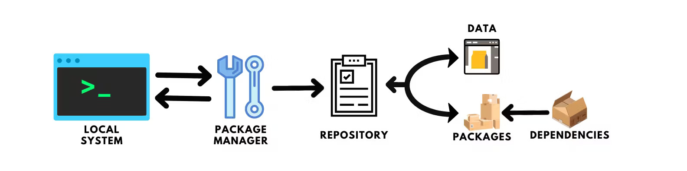

+++
author = "Vighnesh Nilajakar"
title = "Package Management"
date = "2023-06-02"
description = "Package Management in Windows !"
tags = [
    "CLI",
	"Package Management"]
categories = [
    "Applications"]
image = "package_management_poster.jpg"
+++

## Introduction

Installing applications in Windows can be insecure. Often, we download executable files from random websites or rely on the limited selection of applications in the Microsoft Store, which can be paid or unavailable. Additionally, updating these executables downloaded from websites can be a hassle, and there's no guarantee of their authenticity. The Microsoft Store, while convenient, doesn't offer the entire range of applications available. So, what's the solution?

## Package Managers

Package managers are software tools that help manage applications, similar to the proprietary Microsoft Store in Windows. In contrast, Linux uses package managers like apt, yum, DNF, Pacman, etc. However, adhering to the FOSS ideology, we can use a free and open-source package manager for Windows. These package managers allow you to install, uninstall, and update applications free of charge.

## How Package Managers Work

A package manager is a software tool that simplifies the process of installing, updating, and removing software packages on a computer system. It works by maintaining a repository of pre-compiled or pre-packaged software packages. When a user requests to install a specific package, the package manager retrieves the necessary files from the repository and handles the installation process, including resolving dependencies. Package managers also facilitate updates by checking for newer versions of installed packages and providing a streamlined mechanism to upgrade them. Additionally, they allow users to uninstall packages and manage package configurations efficiently.

## Package Managers for Windows :-

Windows now supports a variety of package managers that have significantly improved over time. These package managers offer extensive repositories of software packages and provide convenient features like dependency management, versioning, and automated updates. Discover the power and convenience of these Windows package managers listed below.

* ### Winget

    Microsoft has created an open-source tool called Winget (Windows Package Manager) as a replacement for the Microsoft Store. The Microsoft Store has a vast repository of applications, and this utility greatly assists in managing packages in Windows. Kudos to Microsoft for that! The installation process for Winget is straightforward. You can find the installation guide and usage guide for Winget on the [Microsoft website](https://learn.microsoft.com/en-us/windows/package-manager/winget/#install-winget). You can also use [winget.run](https://winget.run/) to find packages and their installation commands. Here's a GIF showing the installation process of yt-dlp using Winget:

* ### Chocolatey

    However, some applications may not be supported by Winget. In such cases, we can use [Chocolatey](https://chocolatey.org/), which is similar to Winget but supports a broader range of open-source packages. You can visit the Chocolatey website's installation page and usage page for the choco CLI for more information. Chocolatey also has a GUI similar to the Microsoft Store. You can refer to the [installation guide](https://docs.chocolatey.org/en-us/chocolatey-gui/setup/installation) for the Chocolatey GUI. They also maintain a [packages page](https://community.chocolatey.org/packages) where you can find applications and their details. Here's another GIF demonstrating the uninstallation of ShareX using Chocolatey:

* ### Scoop

    [Scoop](https://scoop.sh/) is another package manager that allows you to "scoop" out packages, thereby expanding the variety of applications you can install. Scoop stores applications in a separate directory to sandbox them. It's a great package manager for increasing the repository of applications available for installation. You can visit the Scoop website for easy and clear instructions on how to install it. They also provide a page where you can browse the installable applications. Here's a GIF demonstrating the process of updating all applications using Scoop:

## Conclusion

Using these package managers for installation and management is incredibly easy. I highly recommend utilizing these package managers. There are many more package managers available, such as Scoop, Ninite, and Yarn. Personally, I use Chocolatey and Winget, so I'm not familiar with the others. Feel free to explore other package managers based on your needs.
